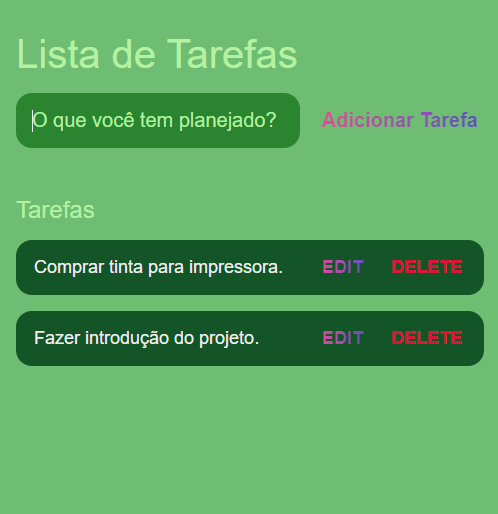

# Lista de tarefas web

# Bem-vindo!

 **Obrigado por conferir este projeto!**

Espero que a Lista de Tarefas possa ser útil para muitas pessoas, ajudando a não se esquecerem de suas tarefas todos os dias. 

# Introdução

A Lista de tarefas web é uma página simples que lista caixas de texto contendo mensagens que podem ser adicionadas, editadas e deletadas após o cumprimento das tarefas inseridas. 

# Utilização

Para utilizar basta digitar a tarefa em questão na caixa "O que você tem planejado?" e em seguida clicar em "Adicionar Tarefa". As tarefas serão listadas ordenadamente de acordo com a primeira tarefa adicionada. Após o cumprimento da tarefa basta deletar a caixa de texto. Assim espero contribuir para sua organização pessoal.

# Nota

Não recomendamos atualizar a página após inserir tarefas pois isso fará com que estas sejam apagadas.
